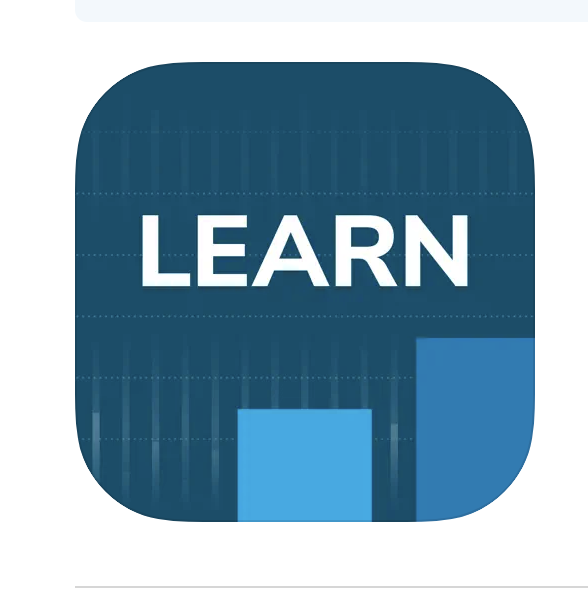
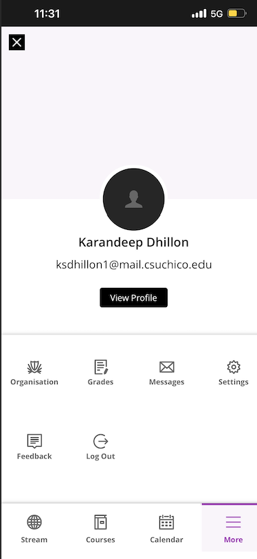
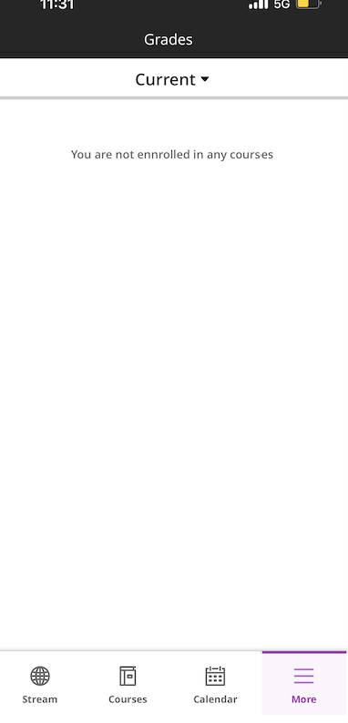

# Checking my grades on the Blackboard App
By Karandeep Dhillon, Date: 09/24/2022

At my university (CSU Chico), we use a service called Blackboard that is the main hub for students and professor to communicate and complete tasks. Professors can send announcements, post assignments, post grades, and do a variety of other things to supplement the learning in class. Students can view assignemtns, submit assignments, check important announcements, and check their grades. Blackboard is primarily accessed through a web browser, but there is also a mobile app. I have the mobile app on my phone so I can be notified of announcements and grade changes immediately. 

I am someone who is always eager to know my grade on all my assingments espically quizzes and tests so when I went to check my grades on the Blackboard mobile app, I noticed they had made a lot of new changes. The first thing I noticed was that they changed the app icon image. The one of the left being the original app icon and the image on the right being the new app icon. I do not understand why they changed the app icon because I preferred the wooden pencil icon over the new one. To me, the wooden pencil instantly lets me know the app is related to school because I have this association between wooden pencils and school. The new, on the other hand, just says "learn" with two bars in the background and if I had not known the location of the Blackboard app on my Iphone I think I would of had to give a second glance to locate the blacboard app. 
                                  
OLD:              NEW: 

When I opened the app, I was prompted with this home page that looked similar to previous version except now there are four tabs on the bottom. Before the new version, the "more" tab was located on the top left and when it was clicked the page would expand with multiple sections and you can click on "grades" to go directly into grades. The "more" tab was also the only tab and the centeral way of going to a different section. Now you can go directly to stream, calendar, and courses using the bottom navigation bar. 

Since they did not add a grades tab, I assumed the only place to look was in the "more tab" similar to how it was before. When I clicked on the "more" tab, I was pleased to find a grades icon/tab. I clicked on the grades icon and was prompted to blank screen under "current" section. This is where I had gotten a little confused because there was **nothing indicating an error has error or how to go about to fix it**.

                                             

