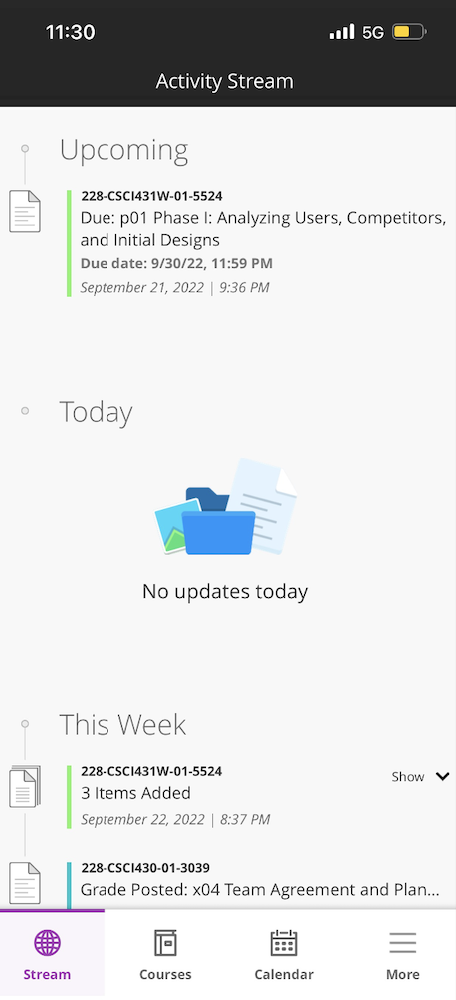

# Checking my grades on the Blackboard App
By Karandeep Dhillon, Date: 09/24/2022

At my university (CSU Chico), we use a service called Blackboard which is the main hub for students and professors to communicate and complete tasks. Professors can send announcements, post assignments, post grades, and do a variety of other things to supplement the learning in class. Students can view assignments, submit assignments, check important announcements, and check their grades. Blackboard is primarily accessed through a web browser, but there is also a mobile app. I have the mobile app on my phone so I can be notified of announcements and grade changes immediately. 

I am always eager to know my grade on all my assignments especially quizzes and tests so when I went to check my grades on the Blackboard mobile app, I noticed they had made a lot of new changes. The first thing I noticed was that they changed the app icon image. The one on the left is the original app icon and the image on the right is the new app icon. I do not understand why they changed the app icon because I preferred the wooden pencil icon over the new one. To me, the wooden pencil instantly lets me know the app is related to school because I have this association between wooden pencils and school. The new, on the other hand, just says "learn" with two bars in the background and if I had not known the location of the Blackboard app on my iPhone I think it would have taken a second glance to locate the Blackboard app. 
                                  
OLD:              NEW: 

When I opened the app, I was prompted with this home page that looked similar to the previous version except now there are four tabs on the bottom. Before the new version, the "more" tab was located on the top left and when it was clicked the page would expand with multiple sections and you can click on "grades" to go directly into grades. The "more" tab was also the only tab and the central way of going to a different section. Now you can go directly to the stream, calendar, and courses using the bottom navigation bar. 

Since they did not add a grades tab, I assumed the only place to look was in the "more" tab similar to how it was before. When I clicked on the "more" tab, I was pleased to find a grades icon/tab. I clicked on the grades icon and was prompted to blank screen under the default "current" section. This is where I had gotten a little confused because there was **nothing indicating an error has error or how to go about to fix it**. There also was not a **visibility of system status** but I assumed the page had successfully loaded with nothing to display. On the previous version, a green check mark or red X mark would appear on the bottom to indicate whether a certain page loaded successfuly. I did not seem to encounter that. 

                                             

I just assumed this was a bug in the new version of the app and carried on to find my grades by clicking on "current" as I assumed it would prompt a drop down menu to pick a semester. My assumption was correct and I clicked on "Fall 2022." From here I was able to click on each course and view my grades. This seemed to be an extra step from the previous layout because in the previous layout you would see your grades for all your classes in one screen instead of having to click on each one individually. 

                                                                                    

