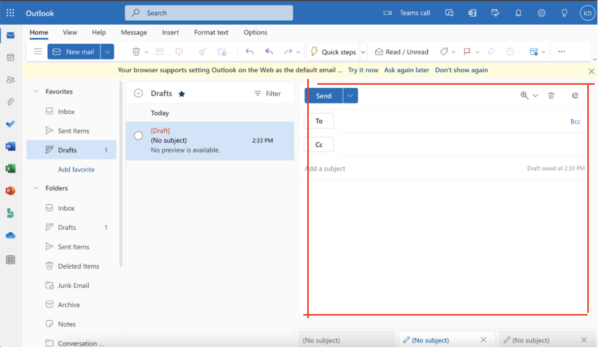
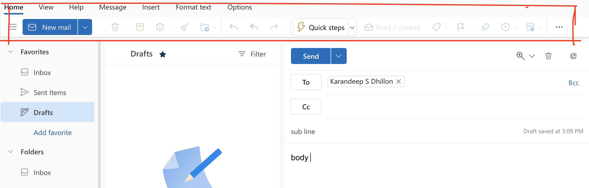
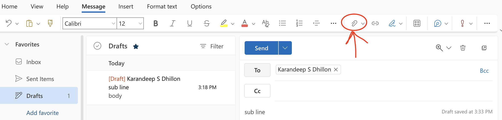

# Adding an Attachment to an email
By Karandeep Dhillon, Date: 12/01/2022

My university (CSU Chico) has been making many changes to the software services we use. One recent change has been the switch from using Gmail to now using Outlook mail. All my personal and school email accounts have been Gmail accounts. I have always liked Gmail's simplistic design and had never had any problems with its **effectiveness** or **efficiency**. From my experience using Gmail, I expected Outlook to be nearly the same in its functionality and interactions.

I needed to email a PDF to one of my professors, so I logged into my Outlook account for the first time. I immediately noticed that Outlook had far more buttons and other things grabbing my attention. After I looked around the home page, I eventually continued my task of creating and sending an email. I clicked on the blue "new mail" button and was prompted with an empty email form in the bottom right corner. This step and interaction were **memorable** since it was exactly the same as it is on Gmail. This also led me to believe that I was making progress toward my goal. 
After clicking "new mail": 
 

I filled out the recieptant, subject line, and body. All I needed to do now was add the PDF and send the email. However, I found myself being lost and stuck since I could not see any button to add an attachment. From my previous experience, there would be a paper click icon/button that I would click to prompt me to add any attachments. I had began looking for a paper clip icon within the email form area. I gradually expanded to looking at all areas on the page for the paper clip, but as the image above illustrates, there was no paper clip icon. 

After clicking around, I was convinced that if I was going to add an attachment it would be through the heading area on the page. 
 

As a result of blank, I started to just go through all the tabs one by one from left to right. I had clicked on the "view" tab, then the "help" tab, and then eventaully found what I had been looking for in the "messages" tab. I saw the paper clip and was finally reliefed that I was able to add an attachment to this email. 

